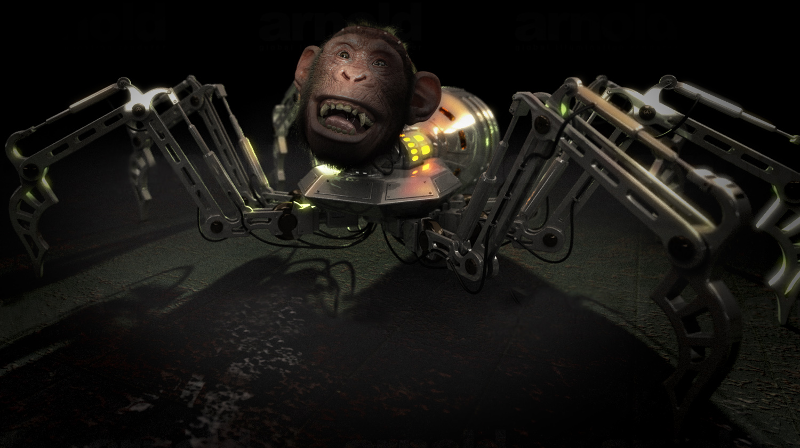

## Master AI Agentic Engineering -  build autonomous AI Agents

### My 6(-ish) week journey to code and deploy AI Agents with OpenAI Agents SDK, CrewAI, LangGraph, AutoGen and MCP

This is recap of my 6 week adventure into the powerful, astonishing and often surreal world of Agentic AI. Yo diggity.